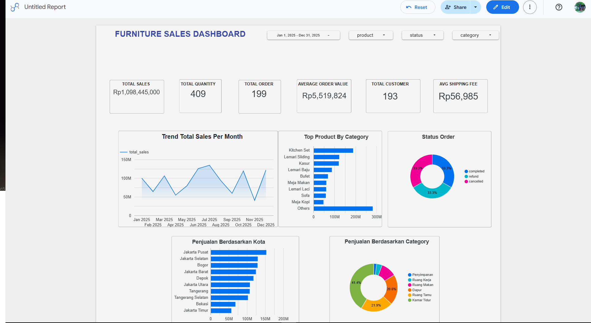

# furniture-sales-dashboard
Dashboard penjualan menggunakan SQL dan Looker Studio. Meliputi proses cleaning data, analisis KPI, tren penjualan, performa produk, dan insight bisnis dari dataset simulasi.
# Furniture Sales Dashboard

## Project Overview
Proyek ini dibuat untuk menganalisis data penjualan furniture menggunakan SQL (BigQuery) dan Looker Studio.

## Objectives
- Membersihkan data penjualan
- Menganalisis performa penjualan
- Membuat dashboard interaktif
- Menemukan insight bisnis

## Tools Used
- Google BigQuery (SQL)
- Looker Studio

## Data Cleaning
- Menghapus data duplikat
- Memperbaiki format tanggal
- Memeriksa missing values
- Standarisasi kategori produk

## KPI Metrics
- Total Sales
- Total Orders
- Total Quantity
- Average Order Value (AOV)

## Key Insights
- Kategori produk dengan penjualan tertinggi
- Tren penjualan bulanan
- Kota dengan kontribusi penjualan terbesar

## Dashboard Preview

